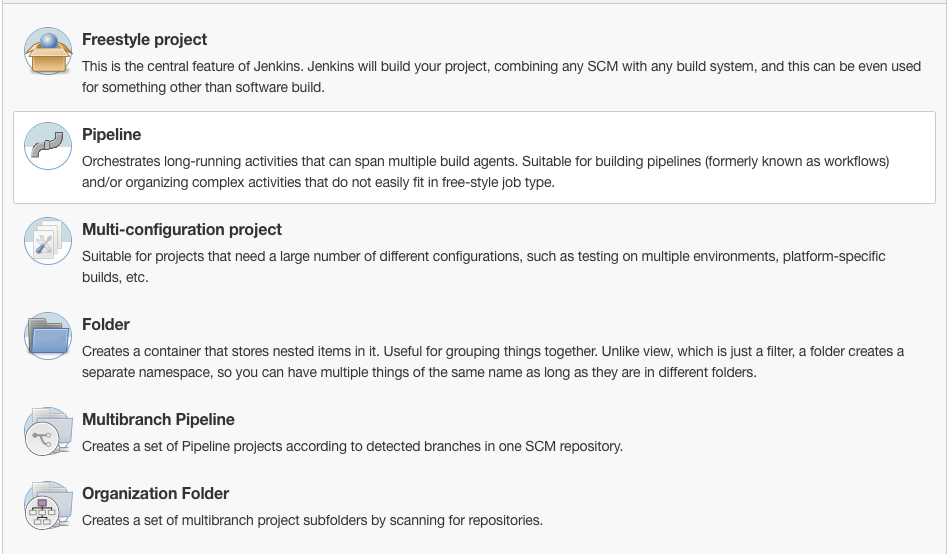

- docker run -d --name jenkins -p 8080:8080 -p 50000:50000 jenkins/jenkins:lts-jdk11
- docker exec -it <container_name> bash
- set username and password

node token.js 

```js
{
  status: 'ok',
  data: {
    tokenName: 'xyz',
    tokenUuid: 'string',
    tokenValue: 'string'
  }
}
```

Create new item: 


